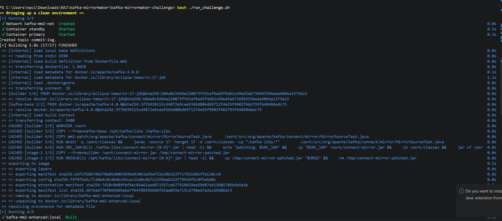
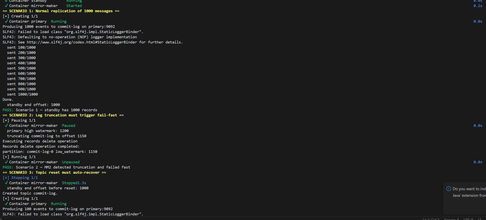
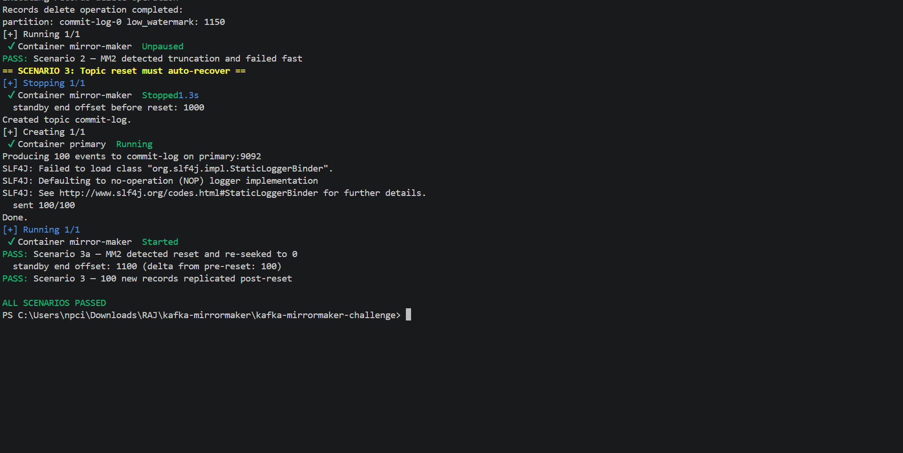

# Kafka MirrorMaker 2 — Truncation & Reset Hardening

MirrorMaker 2 modified to (a) fail-fast when the source log has been truncated
past the position it was replicating from, and (b) auto-recover when the source
topic has been deleted and recreated. Both scenarios are tested end-to-end with
Docker Compose.

## Repository layout

```
.
├── docker-compose.yml         # 2 Kafka clusters + MM2 + producer
├── Dockerfile.mm2             # builds the enhanced MM2 image
├── mm2.properties             # MM2 dedicated-mode config
├── mm2-patch/                 # the one source file we modified, mirrored from the fork
│   └── org/apache/kafka/connect/mirror/MirrorSourceTask.java
├── producer/                  # commit-log producer (Java, kafka-clients only)
│   ├── Dockerfile
│   ├── pom.xml
│   └── src/main/java/com/example/CommitLogProducer.java
└── run_challenge.sh           # the three test scenarios
```

The matching change in the Apache Kafka fork lives in a separate repository
at [rajabhishekmaurya/kafka @ feature/kafka-mm2](https://github.com/rajabhishekmaurya/kafka/tree/feature/kafka-mm2).
Only the one modified Java file is mirrored here under `mm2-patch/` so the
Docker build is self-contained.

## Links

- **Kafka fork:** [rajabhishekmaurya/kafka @ feature/kafka-mm2](https://github.com/rajabhishekmaurya/kafka/tree/feature/kafka-mm2) — single-file change to `MirrorSourceTask.java`
- **Pull request (apache/kafka):** [apache/kafka#22380](https://github.com/apache/kafka/pull/22380)
- **Modified file in the PR:** [`MirrorSourceTask.java`](https://github.com/apache/kafka/pull/22380/files)
- **Docker Hub images:**
  - `<dockerhub-user>/kafka-mm2-enhanced:4.0.0` — apache/kafka:4.0.0 with the patched `MirrorSourceTask`
  - `<dockerhub-user>/commit-log-producer:1.0.0` — the CLI producer

> The images are built locally as `kafka-mm2-enhanced:local` and
> `commit-log-producer:local`. To publish:
> ```
> docker login
> docker tag kafka-mm2-enhanced:local <user>/kafka-mm2-enhanced:4.0.0
> docker push <user>/kafka-mm2-enhanced:4.0.0
> docker tag commit-log-producer:local <user>/commit-log-producer:1.0.0
> docker push <user>/commit-log-producer:1.0.0
> ```

## Setup

Prerequisites: Docker Engine, Docker Compose v2, Bash.

```bash
docker compose build          # builds mm2 + producer images
docker compose up -d primary standby
docker compose exec primary /opt/kafka/bin/kafka-topics.sh \
    --bootstrap-server localhost:9092 \
    --create --topic commit-log --partitions 1 --replication-factor 1 \
    --config retention.ms=60000
docker compose up -d mirror-maker
```

Send 1000 events:

```bash
docker compose run --rm producer --count 1000 \
    --bootstrap-servers primary:9092 --topic commit-log
```

Check the standby:

```bash
docker compose exec standby /opt/kafka/bin/kafka-get-offsets.sh \
    --bootstrap-server localhost:9094 --topic primary.commit-log --time -1
```

## Running the test suite

```bash
./run_challenge.sh
```

The script tears down any previous run, builds images, brings up the stack, and
exercises three scenarios in sequence:

1. **Normal replication** — produce 1000 records to `commit-log`, verify the
   end offset on the standby reaches 1000 for `primary.commit-log`.
2. **Log truncation (fail-fast)** — pause MM2, produce 200 more records, run
   `kafka-delete-records.sh` to lift the low watermark past where MM2 stopped,
   unpause MM2, verify the log line `Source log truncation detected` appears.
3. **Topic reset (auto-recover)** — stop MM2, delete and recreate `commit-log`
   on the primary, produce 100 fresh records, start MM2, verify the log line
   `Source topic reset detected` appears and the standby end offset advances by
   ≥100.

Expected final output: `ALL SCENARIOS PASSED`.

### Sample run (screenshots)

Build of the enhanced MM2 image (cached layers + the bytecode-overlay step that
patches `connect-mirror-4.0.0.jar`):



Scenario 1 finishing (1000 records replicated) and Scenario 2 passing
(truncation triggers the fail-fast):



Scenario 3 passing (topic reset detected, 100 post-reset records replicated)
and the suite finishing with `ALL SCENARIOS PASSED`:



## Log analysis

Truncation (fail-fast) — produced by the modified `MirrorSourceTask.poll()` when
`position < beginningOffset`:

```
ERROR org.apache.kafka.connect.mirror.MirrorSourceTask - Source log truncation
  detected for partition commit-log-0! Replication position 1000 is behind
  source log start offset 1150. 150 records have been irrecoverably lost from
  the source cluster.
```

The task then throws `ConnectException("Source log truncation detected ...")`,
which the Connect framework treats as a task failure (no silent recovery).

Topic reset (recovery) — produced when `position > endOffset && beginningOffset == 0`:

```
WARN org.apache.kafka.connect.mirror.MirrorSourceTask - Source topic reset
  detected at 2026-05-27T... for partition commit-log-0
  (position=1000, beginningOffset=0, endOffset=0). Re-seeking to offset 0 and
  resuming replication.
```

Tail in a separate shell:

```bash
docker compose logs -f mirror-maker
```

## Design rationale

### Why touch only one file

The mandated behaviours are both observable from one place — inside
`MirrorSourceTask.poll()`. The consumer raises `OffsetOutOfRangeException` for
both truncation and reset; the difference is told by comparing the failed
position against `beginningOffsets()` and `endOffsets()` on the source.
Everything else MM2 does (config, metrics, offset syncing) is unchanged.

### Why catch `OffsetOutOfRangeException` instead of polling for state

A periodic side-channel check (e.g. an admin client thread comparing positions)
would race against the consumer's own poll loop and would miss truncations that
happen between checks. Catching the exception is event-driven and exactly
matches when Kafka itself notices.

### Why `consumer.auto.offset.reset = none`

`earliest` makes the consumer silently jump forward to `beginningOffset` on
out-of-range — which is exactly the "silent data loss" failure the task asks us
to detect. `latest` is even worse. `none` makes Kafka raise the exception so we
can decide what to do.

### Triage logic

```
OffsetOutOfRangeException(position) for tp:
    begin = beginningOffsets[tp]
    end   = endOffsets[tp]

    if position > end  and begin == 0  -> topic was recreated; seek(tp, 0)
    if position < begin                 -> data we needed was purged; throw
    else                                -> unexpected; throw (fail safe)
```

The reset branch is conservative on purpose: it only triggers when the source
log looks brand-new (`begin == 0` *and* end has collapsed below our position).
Pure retention-driven trimming where `begin > 0` always falls into the
truncation branch and fails fast — which is what the spec calls for.

### Why `initializeConsumer` was tweaked

With `auto.offset.reset = none`, a fresh partition with no committed offset
would raise `NoOffsetForPartitionException` on first poll. Three added lines
seek to the beginning explicitly when no committed offset is found, so first-
time replication still works.

### Diff size

`git diff apache/kafka@4.0.0` on the fork touches only
`connect/mirror/src/main/java/org/apache/kafka/connect/mirror/MirrorSourceTask.java`:

- 4 new imports
- 1 new `catch (OffsetOutOfRangeException ...)` branch in `poll()` (5 lines)
- 1 new `handleOutOfRangeOffsets(...)` method (~35 lines incl. javadoc)
- 4-line change inside `initializeConsumer(...)` to seek-to-beginning for
  uncommitted partitions

Well under the 500 LOC budget.

## AI usage

I used Claude to accelerate the work but made all design decisions and
reviewed every line. Concretely:

- **Reading the existing `MirrorSourceTask.java`** — I had Claude summarise the
  control flow of `poll()` and `initializeConsumer()` so I could see the
  exception-handling layout before adding a new catch branch.
- **Picking the discriminator between truncation and reset** — I sketched both
  scenarios and asked Claude to challenge the rule
  `position > end && begin == 0 → reset; position < begin → truncation`. We
  agreed it's safe because the reset branch requires `begin == 0`, so plain
  retention-driven trimming can never be mistaken for a reset.
- **Speeding up the Docker build** — instead of rebuilding all of Apache Kafka
  (~30 min on Gradle), Claude suggested compiling the one changed file against
  the jars from `apache/kafka:4.0.0` and overlaying the resulting `.class`
  files into the existing `connect-mirror-4.0.0.jar`. Same classloader, same
  package, so package-private references resolve fine. Build time: ~10s.
- **Drafting the `run_challenge.sh` skeleton** — Claude wrote the first cut,
  which I rewrote to use `kafka-get-offsets.sh` instead of `du` byte counts
  (which were too fragile) and to coordinate stop/start of MM2 around the
  topic reset properly.

What I did not use AI for: the choice to set `consumer.auto.offset.reset=none`,
the decision to seek-to-beginning in `initializeConsumer`, or the structure of
the test scenarios. Those came from reading the Kafka consumer Javadoc and the
PDF spec directly.
